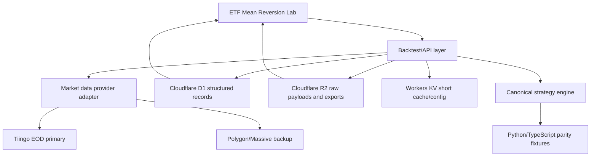

# Technical Foundation and Vendor Plan

Last updated: 2026-07-12

## Executive Summary

The ETF Bollinger/RSI MVP is useful as an exploratory research tool, but the
foundation is not yet production-sound. The strategy logic is deterministic and
the indicator calculations are causal, but the product still depends on an
uncontracted Yahoo chart endpoint, browser-only backtests, hardcoded ETF
metadata, hand-rolled charting, and no durable storage.

The next engineering step is not another strategy. It is a foundation release
that makes the research reproducible, auditable, and vendor-backed.

P0 decisions:

1. Fix and test Strategy 2 execution semantics before relying on scores.
2. Move market data behind a provider abstraction with a licensed EOD source.
3. Add canonical OHLCV validation and Python/TypeScript parity fixtures.
4. Replace the main chart with a financial chart library.
5. Add D1/R2 persistence only after the data contract is stable.

## Team Review

### Engineering 1: Data and Strategy Correctness

Findings:

- Strategy 2 currently documents completed-candle execution, but the Python and
  web implementations should be tightened with a fixture that proves exactly
  when the signal is allowed to affect returns.
- The Python package has no canonical OHLCV loader yet, while Strategy 2 needs
  open, high, low, and close.
- Yahoo Finance is acceptable for a prototype, but it is not a production vendor
  contract and does not solve ETF universe, holdings count, survivorship, or
  redistribution terms.

Execution recommendation:

- Define Strategy 2 as one of these explicit modes and test it everywhere:
  - `next_open`: signal from completed day `t` enters at day `t+1` open.
  - `next_close`: signal from completed day `t` enters at day `t+1` close and
    earns returns starting after that close.
- Use one mode in the YAML, Python package, website, and reports.
- Prefer `next_open` once vendor OHLC quality is strong enough. Until then,
  label any close-to-close approximation clearly.

### Engineering 2: Frontend and Charting

Findings:

- The current main chart uses custom SVG paths and overlays ETF price and equity
  on independent scales, which can make relative movement look more comparable
  than it is.
- Signal audit needs price candles, Bollinger Bands, RSI, signal markers,
  equity, drawdown, and position exposure.
- `web/app/page.tsx` carries data fetching, strategy math, scoring, charting,
  CSV import, and layout in one component.

Execution recommendation:

- Adopt TradingView Lightweight Charts for the main price/equity interface.
- Keep the custom SVG only for tiny sparklines.
- Split the web app into `lib/backtest.ts`, `lib/strategy-synthesis.ts`,
  `components/StrategyChart.tsx`, `components/Scoreboard.tsx`, and
  `components/SettingsPanel.tsx`.

### Engineering 3: Backend, Storage, Hosting

Findings:

- The Sites/Cloudflare scaffold is reasonable for MVP hosting.
- Storage is currently disabled (`d1: null`, `r2: null`), and the Drizzle schema
  is empty.
- `/api/history` is an unauthenticated Yahoo proxy with no durable cache,
  provider abstraction, retry policy, quota tracking, or complete-bar filter.
- Saved runs, imported universes, journals, and scheduled signals do not exist.

Execution recommendation:

- Keep Sites/Cloudflare Workers as the hosting layer.
- Add D1 after the data model is stable.
- Add R2 for immutable raw vendor payload snapshots and exported reports.
- Use KV only for low-latency cache/config, not canonical research records.
- Use Sign in with ChatGPT / Sites access policy before user-specific writes.

### PM and UX

Findings:

- The MVP is analytically useful, but still too finance-jargon-heavy for
  non-finance users.
- A first-time user should immediately understand:
  - what ETF was tested,
  - whether the strategy beat just holding,
  - how bad the worst historical drop was,
  - what the latest signal means,
  - that the product is research only, not a trading recommendation.

Execution recommendation:

- Rename core UI labels into plain language.
- Show data freshness and source near every result.
- Move advanced settings behind a collapsed control.
- Add beginner presets and score driver explanations.

## Vendor Research

### Market Data: Historical EOD OHLCV

Recommended near-term primary: Tiingo EOD.

Why:

- Official EOD endpoint supports historical prices by ticker and date range:
  <https://www.tiingo.com/documentation/end-of-day>
- Provides raw and adjusted open, high, low, close, volume fields.
- Documentation states adjusted fields follow the CRSP-style methodology and
  incorporate splits and dividends.

Fit:

- Good first production-grade EOD source for ETF backtesting where adjusted OHLC
  matters.
- Needs a redistribution/license review before showing cached data publicly.

Backup / higher-scale candidate: Polygon/Massive stock aggregates.

Why:

- Official aggregate endpoint provides custom historical OHLCV bars:
  <https://polygon.io/docs/rest/stocks/aggregates/custom-bars>
- Plan tiers support EOD, delayed, and real-time recency with different history
  depths.

Fit:

- Strong for scalable market-data APIs and intraday expansion.
- Confirm corporate-action semantics for ETF total-return-style research. The
  aggregate endpoint documents split adjustment; dividend handling may require
  separate corporate-action logic.

Prototype-only fallback: Yahoo chart endpoint.

Fit:

- Keep for local demo/dev only.
- Do not treat as a contracted production source.
- Always label source and freshness.

### ETF Universe and Holdings

Recommended candidate: Intrinio ETF holdings/reference data.

Why:

- Official ETF holdings endpoint returns constituent securities, identifiers,
  weights, and `as_of_date`:
  <https://docs.intrinio.com/documentation/web_api/get_etf_holdings_v2>
- It can support the rule "ETF must have more than 10 stock holdings" with a
  dated holdings snapshot.

Fit:

- Use to replace hardcoded `stockCount` values.
- Persist eligibility snapshots so historical runs can avoid survivorship drift.

Fallback:

- Maintain a curated ETF CSV imported from issuer files or a licensed data
  export. This is acceptable for a private MVP but should be marked as manually
  maintained metadata.

### Charting

Recommended primary: TradingView Lightweight Charts.

Why:

- Built for interactive financial charts:
  <https://tradingview.github.io/lightweight-charts/>
- Installable as an npm package.
- Licensed under Apache 2.0:
  <https://raw.githubusercontent.com/tradingview/lightweight-charts/master/LICENSE>

Fit:

- Candles, time scale, crosshair, price lines, and markers are a natural match
  for signal audit.

Secondary candidate: Apache ECharts.

Fit:

- Consider only if the site needs richer analytical dashboards, brushing,
  synchronized panels, or non-market visualizations beyond trading charts.

### Storage

Recommended structured store: Cloudflare D1.

Why:

- D1 is Cloudflare's managed serverless database with SQLite semantics and Worker
  access:
  <https://developers.cloudflare.com/d1/>

Use for:

- ETF universe snapshots.
- Normalized price bars.
- Strategy run records.
- Signals.
- User watchlists after auth is added.

Recommended object store: Cloudflare R2.

Why:

- R2 is object storage for large unstructured data:
  <https://developers.cloudflare.com/r2/>

Use for:

- Raw vendor payload snapshots.
- Backtest exports.
- CSV imports.
- Report artifacts.

Recommended cache/config store: Cloudflare Workers KV.

Why:

- KV is global low-latency key-value storage:
  <https://developers.cloudflare.com/kv/>

Use for:

- Short-lived provider response cache.
- Feature flags and app config.
- Do not use KV as the canonical record of runs or signals.

### Hosting and Runtime

Recommended: keep current Sites + Cloudflare Workers deployment.

Why:

- The repo already has `web/.openai/hosting.json` and a deployed Sites project.
- The current app is a good fit for an edge-hosted research dashboard.

Required additions before production:

- Runtime secrets for provider API keys.
- Server-side provider abstraction.
- Durable cache/persistence.
- Provider timeout, retry, and error reporting.
- Build/test checks in GitHub.

### Auth

Recommended: Sign in with ChatGPT / Sites access controls for saved data.

Use auth before adding:

- Saved strategy runs.
- User-specific watchlists.
- Uploaded ETF universes.
- Journals or notes.

Keep anonymous access acceptable for:

- Read-only demo mode.
- Public documentation.

### Observability

Minimum:

- Provider request count, status, latency, and cache hit rate.
- Per-symbol fetch failures.
- Backtest run count and duration.
- Build/test status from GitHub.

Potential vendor:

- Sentry for client/server exceptions if the product becomes more than a private
  tool.

## Target Architecture

## Data Contracts

### Price Bar

Required fields:

- `symbol`
- `date`
- `open`
- `high`
- `low`
- `close`
- `volume`
- `adjusted`
- `source`
- `source_version`
- `fetched_at`
- `as_of_date`
- `is_complete`

Validation:

- Prices must be positive.
- `low <= open <= high`
- `low <= close <= high`
- Dates must be unique per symbol/source.
- Rows must be sorted by trading session.
- Current trading day must be excluded until vendor marks the bar complete or
  the app's exchange-calendar cutoff has passed.

### ETF Universe Snapshot

Required fields:

- `symbol`
- `name`
- `asset_class`
- `issuer`
- `holdings_count`
- `equity_holdings_count`
- `as_of_date`
- `source`
- `eligible_for_strategy_2`

Rule:

- Strategy 2 eligibility must use `equity_holdings_count > 10`.

### Strategy Run

Required fields:

- `strategy_id`
- `strategy_version`
- `symbol`
- `params_json`
- `execution_mode`
- `data_source`
- `data_as_of`
- `code_version`
- `run_at`
- `metrics_json`
- `signals_json` or linked signal rows

Rule:

- Persisted runs must be computed server-side from the canonical data contract.

## Execution Plan

### Release 0.1: Foundation Fixes

Owner: engineering lead.

Deliverables:

- Decide and codify Strategy 2 execution mode.
- Add OHLCV loader/validator in Python.
- Add fixture parity tests between Python and web calculations.
- Update website labels to show source, data date, and research-only guardrail.
- Replace `web/README.md` starter text with product-specific docs.

Acceptance:

- `python3 -m unittest` passes.
- `npm test` passes.
- A fixture proves Strategy 2 has no look-ahead bias under the chosen execution
  mode.

### Release 0.2: Vendor Abstraction

Owner: backend/data engineer.

Deliverables:

- Add `/api/history` provider interface.
- Keep Yahoo as `demo` provider.
- Add Tiingo provider behind server-side secret.
- Add provider response normalization to the Price Bar contract.
- Add cache headers plus durable cache design.

Acceptance:

- No provider key is sent to the browser.
- Every result displays provider, last complete bar date, and adjusted/raw state.
- Provider failures return actionable messages.

### Release 0.3: Chart and UX Trust

Owner: frontend engineer + UX.

Deliverables:

- Replace main chart with TradingView Lightweight Charts.
- Show candles, Bollinger Bands, RSI threshold panel, signal markers, equity,
  and drawdown.
- Collapse advanced settings.
- Rename metrics with plain-language labels.

Acceptance:

- A non-finance user can explain whether the strategy beat just holding and
  what the latest signal means.

### Release 0.4: Storage and Saved Runs

Owner: backend/storage engineer.

Deliverables:

- Enable D1 and add migrations for universe snapshots, price bars, runs, and
  signals.
- Add R2 raw payload archive.
- Add authenticated saved watchlists/runs.

Acceptance:

- Saved runs can be reproduced from stored params, data vintage, and code
  version.

### Release 1.0: Operational Beta

Owner: PM + full engineering team.

Deliverables:

- Scheduled daily refresh after market close.
- Provider quota and error monitoring.
- GitHub CI for Python tests, web tests, lint, and build.
- Production vendor contract chosen and documented.

Acceptance:

- The site can be used as a dependable manual research workflow without hidden
  data assumptions.

## Immediate Backlog

1. P0: Decide `next_open` vs `next_close` for Strategy 2 and add no-lookahead
   fixture tests.
2. P0: Add canonical OHLCV loader and validation.
3. P0: Add Python/web parity fixture.
4. P1: Replace Yahoo-only route with provider abstraction.
5. P1: Select Tiingo trial/account for EOD adjusted OHLC validation.
6. P1: Evaluate Intrinio ETF holdings for universe snapshots.
7. P1: Replace the main chart with TradingView Lightweight Charts.
8. P2: Enable D1/R2 after contracts are stable.
9. P2: Add auth-gated saved runs and watchlists.
10. P2: Add scheduled daily refresh and observability.

## Current MVP Verdict

The MVP worked as a research prototype. It should not yet be treated as a
production-grade trading research foundation. The next step is a foundation
release focused on timing correctness, data contracts, vendor abstraction, and
reproducible results.
